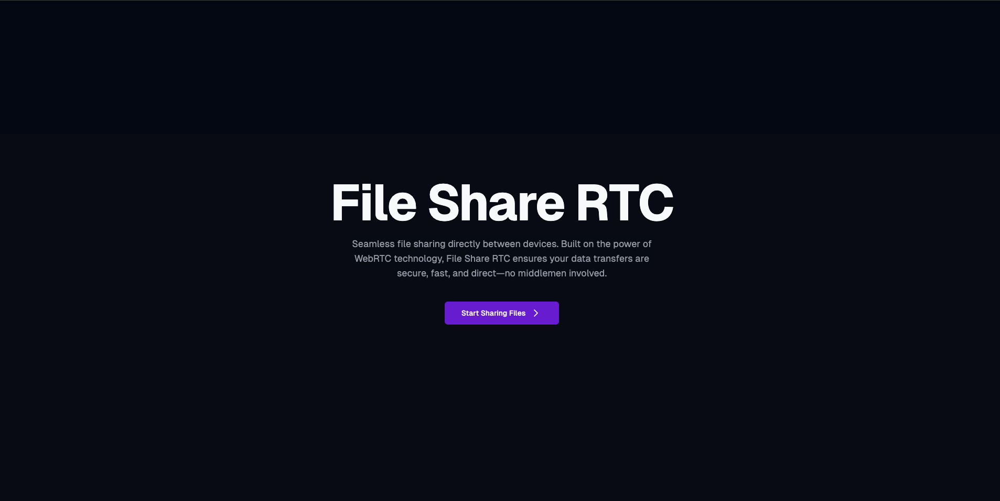
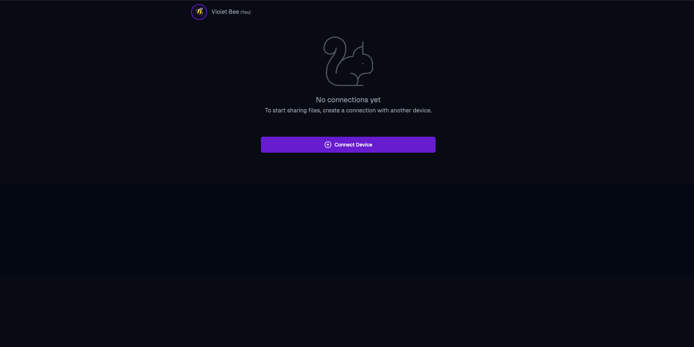

# File Share RTC : Effortless, Secure File Sharing Across Devices <!-- omit in toc -->

File Share RTC  aims to provide a hassle-free and secure way to share files between devices. The platform leverages WebRTC technology, ensuring that your files are transferred directly and securely, with no intermediary server access.

- [Features](#features)
- [Simple Steps to Start Sharing](#simple-steps-to-start-sharing)
- [Development](#development)
  - [Clone and run locally](#clone-and-run-locally)
  - [Generating db types](#generating-db-types)

## Features

- **No Account Setup Required**: Start sharing immediately with an automatically created anonymous session upon visiting our website.


- **End-to-End Encryption**: All files are encrypted from start to finish, ensuring your data remains private and secure.
- **No File Size Limit**: File Share RTC is engineered to manage files of any size, leveraging advanced chunk-based processing to facilitate the sharing of large files. While there is no hard limit on the file size you can transfer, the performance and efficiency depend on your device’s capabilities and network conditions. This robust system ensures smooth operation by adapting to various environments, though extremely large files may require more time and stable network connections to transfer successfully.

## Simple Steps to Start Sharing

1. **Visit the Website**: Click on the "Start Sharing Files" button to initiate an anonymous session.
   

2. **Connect Your Devices**: Hit the "Connect Device" button, then "Generate Connection Code".
   

3. **Establish Connection**: On another device, follow the same steps and enter the connection code from the first device to connect.
   
4. **Begin Transferring Files**: Drag and drop files or use the "Send File" button. Files will need to be accepted on the receiving device.
Note: Connection codes expire after 5 minutes. For a new code, simply restart the process on the initiating device.

## Development

### Clone and run locally

1. Clone the repository and install dependencies:
   ```bash
   bun install
   ```
2. Run Supabase:
   ```bash
   bunx supabase start
   ```
3. Create a `.env.local` based on the `.env.example` file. You can get the Supabase variables from the output of the previous command, or by running:
   ```bash
   bunx supabase status
   ```
4. Start the development server:
   ```bash
   bun dev
   ```

### Generating db types

This command will reset the local database and generate types for the Supabase client based on the new schema. If you only want to generate types without resetting the database, you can remove the first command.

```bash
bunx supabase db reset && bunx supabase gen types typescript --local > supabase/types.gen.ts
```
